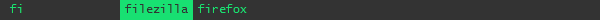

---
title: amenu 
...


About
-----

amenu is a simple and customizable application launcher very much inspired by the excellent [dmenu](http://tools.suckless.org/dmenu/).

Download
--------

There's no installer, simply download and run [amenu.exe](https://github.com/owlnical/amenu/releases/download/v0.3/amenu.exe).

Usage
-----

 1. Press `win + space` to open the amenu interface.
 2. Start typing to search for executables.
 3. Use `←` `→` or `tab` `shift + tab` to change selection.
 4. Press `enter` to launch the selected program.

Settings
--------

There are three separate files for settings available via the tray menu:

 - `paths.ini` - directories to be scanned for .exe files.
 - `hotkeys.ini` - key combinations to show and interact with the GUI.
 - `misc.ini`  - miscellaneous settings.

Theme
-----

There are two variations of the default theme included with amenu.


You can switch theme using the tray menu or by editing misc.ini.

### Create child theme

In the following example we will change the color of the default theme to green by creating a new child theme.

 1. Start by opening the theme directory (tray menu > theme > directory...)
 2. Make a copy of the existing child theme folder `default-orange`, name it `default-green`
 3. Using notepad open the file default-green/gui.css
 4. Change the two color fields from `#fb8c00` (orange) to `#18e072` (green). Your file should now look something like this:

```css
body,div {
	color: #18e072;
}

.selected {
	background-color: #18e072;
}
```

 5. Make sure both lines still end with a semi-colon (`;`)
 5. Save the file and restart amenu (tray menu > restart)
 6. Choose your new theme in the theme sub menu

We have now created a new child theme, default-green, which uses the default theme as base. amenu should now look something like this:


 
If you want another color than green you can use this [color picker](https://ddg.gg/?q=color+picker). Simply choose the color you want and copy the value from the bottom text box into gui.css.

### Create a theme from scratch

Note that making a theme from scratch requires some experience with HTML and CSS. 

The amenu themes are built using three files placed in their own subfolder in `%appdata%\amenu\theme`:

 - `gui.ini` - size and position of the gui window
 - `gui.html` - elements to be pupulated by amenu
 - `gui.css`  - styling for gui.html

The html file requires two IDs.

 - search - inner html will be set to the user search string
 - results - inner html will be set to the results matching the search string

Excerpt from the default theme gui.html:

```html
<div id="search">
</div>
<div id="results">
</div>
```

When results are generated the will be placed inside a new div with a numbered ID `result<number>`. if the result is selected byt the user it will have the class `selected` otherwise it will have the class `normal`.

Example: The users types in the search string `fi` and there are two results: `filezilla` and `firefox`. amenu would then change the html above to this:

```html
<div id="search">
	fi
</div>
<div id="results">
	<div id="result1" class="selected">
		filezilla
	</div>
	<div id="result2" class="normal">
		test-executable-B
	</div>
</div>
```

A complete html file should look something like this and can then by styled accordingly using gui.css:

```html
<!DOCTYPE html>
<html>
	<head>
		<link rel="stylesheet" type="text/css" href="gui.css">
	</head>
	<body>
		<div id="search">
		</div>
		<div id="results">
		</div>
	</body>
</html>
```

For further details have a look at the [default theme](https://github.com/owlnical/amenu/tree/master/theme/default) which is heavily commented.